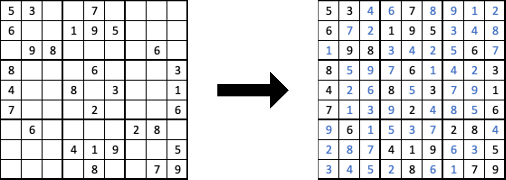

# Sudoku Solver

This project implements a Sudoku solver using depth-first search with forward checking to reduce the search space. 
It applies local consistency constraints to prune invalid paths early by checking the validity of rows, columns, and 3×3 blocks at each assignment step. 
The solver enforces constraint satisfaction dynamically, making it efficient and reliable for solving standard 9×9 Sudoku puzzles.