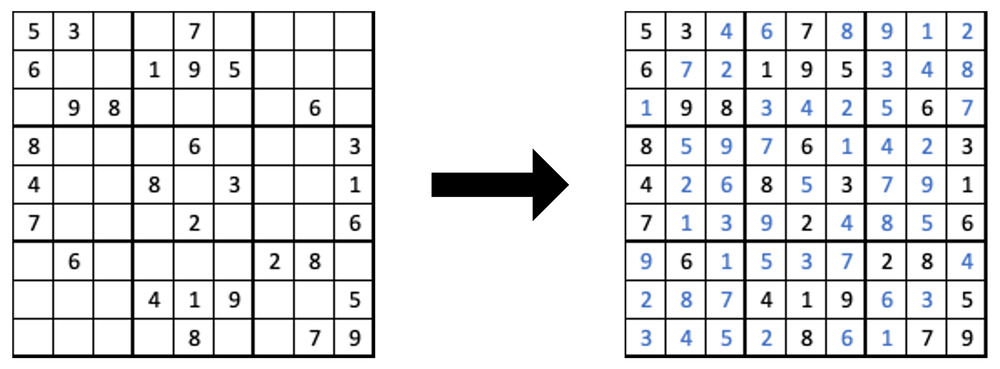

# Sudoku Solver

This project implements a Sudoku solver using depth-first search with forward checking to reduce the search space. 
It applies local consistency constraints to prune invalid paths early by checking the validity of rows, columns, and 3×3 blocks at each assignment step. 
The solver enforces constraint satisfaction dynamically, making it efficient and reliable for solving standard 9×9 Sudoku puzzles.

    

This [Jupyter Notebook](solve.ipynb) shows how to load a [puzzle](sudoku1.txt) into the `Sudoku` class and solve it.

## Input Format
The puzzle is stored as a plain text file, with 9 rows and 9 digits per row.
Use `0` to represent empty cells.

View [here](sudoku1.txt) for an example.
